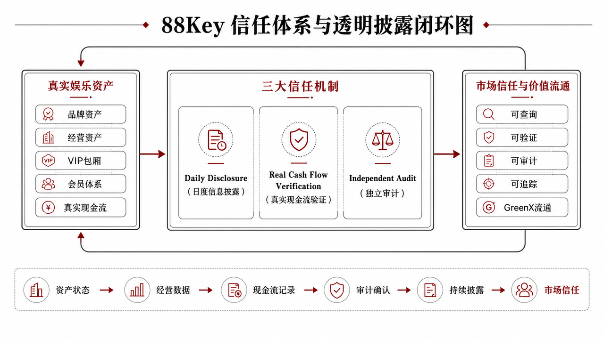

# Part 2｜项目定位：88Key 与娱乐 RWA 资本网络

## PDF 图示

### PDF page 8

      

## PDF 图示

### PDF page 9

      

## PDF 图示

### PDF page 10

      

## PDF 图示

### PDF page 11

      

## PDF 图示

### PDF page 12

      
