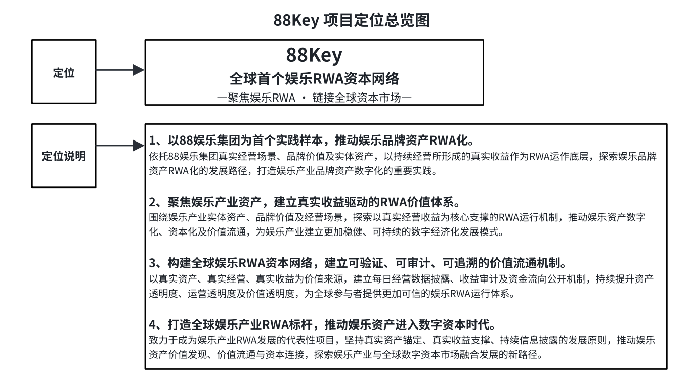

# 2.2 全球首个娱乐 RWA 资本网络的战略定位

88Key 的战略定位，来自娱乐产业与 RWA 赛道之间的结构性结合机会。

从产业侧来看，娱乐产业天然具备真实消费场景、持续用户关系、品牌价值沉淀和经营现金流基础。酒吧、KTV、Club、Live House、VIP 包厢、餐饮娱乐空间等线下场景，既是消费发生的地方，也是品牌影响力、会员体系、消费数据和持续现金流形成的资产载体。

从资本侧来看，传统娱乐资产长期面临 流动性不足、透明度不足、资本化路径有限 等问题。即便一个娱乐品牌具备真实经营能力和稳定现金流，其资产价值也往往局限于本地市场、企业内部经营体系或传统融资路径之中，难以通过标准化方式进入全球资本网络。

88Key 的战略价值，正是在现实娱乐产业与全球数字资本市场之间建立连接。

一端是 真实娱乐资产，包括品牌资产、经营场景、会员体系、场景资源和真实现金流；另一端是 全球数字资本市场，包括资产发行、持有登记、交易流通、价值发现和全球配置。88Key 通过 RWA 机制，将这两个原本相对分离的体系连接起来，使娱乐资产从传统线下经营单元，逐步升级为能够被市场识别、验证和流通的数字资本资产。

这一战略定位使 88Key 具备三个核心特征：

第一，资产来源真实。88Key 以 88 娱乐集团作为首个实践样本，围绕真实经营场景、品牌资产、实体资产和持续经营现金流展开资产映射。

第二，运行机制透明。88Key 将通过经营数据披露、现金流验证、收益审计及资金流向管理等机制，持续提升资产透明度、运营透明度和价值透明度。

第三，价值流通全球化。88Key 将依托 GreenX 数字资产交易所及相关数字金融基础设施，推动娱乐资产从本地经营价值走向全球数字资本市场，实现更广范围的价值发现与资本连接。

因此，88Key 的战略定位并不是推出一个单点型娱乐项目，而是构建一套面向娱乐产业的 资产识别体系、价值验证体系、权益表达体系、透明披露体系与全球流通体系。

88Key 的战略定位，不是单一娱乐项目数字化，而是推动娱乐产业资产形成可验证、可审计、可流通的数字资本表达。

此图展示 88Key 的核心定位与战略方向。88Key 以 88 娱乐集团为首个实践样本，围绕真实娱乐资产、真实经营场景及持续经营现金流，推动娱乐品牌资产RWA 化，并通过可验证、可审计、可追溯的价值流通机制，构建连接现实娱乐产业与全球数字资本市场的娱乐 RWA 资本网络。
