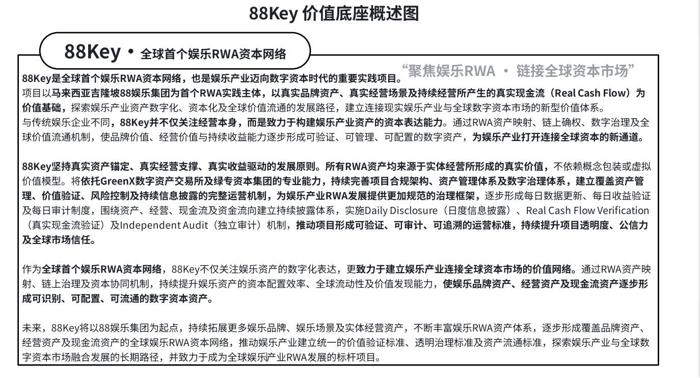

# 3.2 88 娱乐集团的实体经营基础

88Key 选择以 88 娱乐集团作为首个实践主体，是因为娱乐 RWA 需要一个具备真实经营场景、真实资产载体和持续现金流基础的验证样本。 对于 RWA 项目而言，首个实践主体的意义并不只是提供资产来源，更在于验证一套资产识别、现金流披露、权益表达和市场流通机制是否具备长期可复制性。

在娱乐产业中，资产价值并不只存在于账面资产之中，更存在于线下经营场景、品牌服务能力和用户消费关系之中。一个成熟的娱乐经营主体，通常具备多层价值基础：线下场地承载消费，会员体系沉淀用户，品牌活动提升影响力，包厢与娱乐空间形成经营单元，日常消费与服务收入构成现金流来源。 这些要素共同构成娱乐产业资产化的现实基础。

88 娱乐集团所代表的，正是这一类具备现实经营基础的娱乐资产样本。其价值并不是抽象概念，而是来自具体的经营场景和商业活动，包括 VIP 包厢、酒吧区域、KTV 包厢、会员消费、品牌活动、娱乐服务及持续经营现金流 等资产和经营要素。这些要素为 88Key 建立娱乐 RWA 资产体系提供了可识别、可追踪、可验证的现实基础。

对于 88Key 而言，88 娱乐集团的意义不只是项目起点，更是娱乐 RWA 标准化验证的首个实体样本。通过这一实践主体，88Key 可以将娱乐产业中的多类现实资产进行识别、分类和映射，并进一步验证 资产数字化、现金流披露、权益管理、市场流通与生态复制 之间的协同关系。

这也是 88Key 与普通娱乐项目的重要区别。传统娱乐项目更关注门店经营和消费体验，而88Key 更关注 如何将娱乐经营资产转化为可验证、可配置、可流通的数字资本资产。88 娱乐集团作为首个实践主体，为这一转化提供了真实资产基础、真实经营环境和真实现金流验证场景。

此图展示 88Key 的核心价值来源与长期运行原则。88Key 以真实品牌资产、真实经营场景及持续经营形成的真实现金流作为价值基础，并通过 日度信息披露、真实现金流验证和独立审计机制，推动娱乐资产形成 可验证、可审计、可追溯 的 RWA 运行标准。该图体现了 88Key 从现实娱乐资产到数字资本资产的价值生成逻辑，也是其面向全球市场建立资产信用的重要基础。
