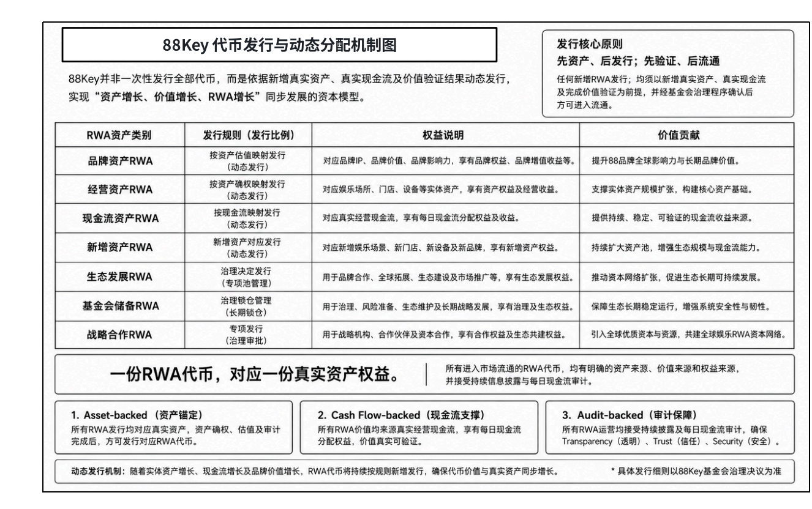

# 5.5 发行网络、价值锚定与流通机制

88Key 的发行网络选择以太坊，意味着其数字权益表达建立在更开放、更可查询、更具全球参与基础的链上环境之中。 对于 RWA 项目而言，发行网络不仅是技术层面的选择，也关系到资产可查询性、持有记录可追踪性、流通路径透明度和全球用户参与便利性。通过以太坊网络，88Key 能够在链上形成更加清晰的代币基础信息和权益记录入口。

在价值锚定层面，88Key 强调 真实品牌资产 + 真实经营现金流。这一设计决定了 88Key的价值表达不能脱离底层资产和经营表现。品牌资产提供长期认知和价值承接基础，经营资产提供现实场景和现金流形成空间，真实现金流则提供资产价值验证的核心依据。88Key 的价值锚定，不是单一价格锚定，而是围绕真实娱乐资产、持续经营能力和现金流验证机制建立的综合价值基础。

在发行机制层面，88Key 并非一次性发行全部代币，而是围绕新增真实资产、真实现金流及价值验证结果，建立动态发行与分配机制。 该机制的核心原则是：先资产，后发行；先验证，后流通。 任何新增 RWA 发行，都应以 新增真实资产、真实现金流及完成价值验证 为基础，并经基金会治理程序确认后，方可进入流通体系。这一设计使 88Key的发行机制不再是单纯的数量扩张，而是围绕 资产增长、价值增长与 RWA 增长 同步展开。随着 品牌资产、经营资产、现金流资产、新增资产、生态发展资产、基金会储备资产及战略合作资产 逐步接入，88Key 将通过统一的资产验证、价值确认、信息披露和治理审核机制，推动娱乐 RWA 资产体系持续扩展。

在流通机制层面，88Key 将依托 GreenX 数字资产交易所形成 资产登记、持有管理、交易流通和价值发现路径。GreenX 的作用不只是提供交易场景，更是为娱乐 RWA 资产提供市场化承接结构，使相关资产能够从本地娱乐场景走向全球数字资本网络。通过这一流通体系，用户可以围绕 88Key 完成 资产持有、权益管理、流通配置和生态参与。

需要强调的是，流通机制并不等同于价格保障机制。 88Key 的市场表现将受到资产质量、经营现金流、市场供需、平台规则、交易深度、信息披露和外部市场环境等多重因素影响。项目所构建的是资产数字化、权益表达和全球流通路径，而不是对未来价格或收益作出确定性承诺。

因此，88Key 的发行网络、价值锚定与流通机制，本质上共同构成了娱乐 RWA 资产进入数字资本市场的基础通道。 这一通道使娱乐产业资产能够从传统线下经营结构，进入更透明、更可验证、更具全球参与能力的数字资本体系。

此图展示 88Key 的代币发行与动态分配机制。 88Key 并非一次性发行全部代币，而是围绕 新增真实资产、真实现金流及价值验证结果 进行动态发行，形成 “资产增长、价值增长、RWA 增长” 同步发展的资本模型。该机制以 “先资产，后发行；先验证，后流通” 为核心原则，并通过 资产锚定、现金流支撑与审计保障，确保进入流通体系的 RWA 资产具备明确的资产来源、价值来源与权益来源。
