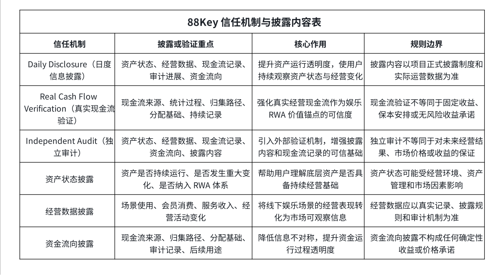

# 7.5 资产状态、经营数据与资金流向披露

资产状态、经营数据与资金流向，是 88Key 信息披露体系中的三类关键内容。 对于娱乐 RWA项目而言，用户真正关心的不只是代币是否可以流通，更关心底层资产是否仍在运行、经营数据是否真实形成、现金流是否能够持续记录，以及资金流向是否具备透明机制。

通过资产状态、经营数据与资金流向披露，88Key 将真实娱乐资产从传统线下经营体系中释放出来，使其逐步具备面向全球数字资本市场的透明基础。

资产状态披露主要围绕底层娱乐资产的运行情况展开，包括资产是否处于正常运营状态、资产是否发生重大变化、资产是否持续纳入 RWA 体系，以及资产是否具备继续产生经营价值的条件。对于 88Key 的首个验证模型而言，VIP 包厢作为试点资产，其状态披露将成为用户理解娱乐 RWA 运行情况的重要窗口。

经营数据披露则围绕娱乐资产的实际运营展开，包括场景使用情况、会员消费情况、服务收入情况、经营活动变化以及与现金流形成相关的数据记录。经营数据是连接现实场景与数字资产价值的重要桥梁。 如果没有经营数据，娱乐 RWA 就容易停留在资产概念层面；有了持续经营数据，用户才能更清晰地理解资产价值如何形成。

资金流向披露则是现金流透明机制的重要组成部分。资金流向涉及现金流来源、归集路径、分配基础、审计记录和后续用途等内容。对于面向全球用户的娱乐 RWA 项目而言，资金流向披露可以降低信息不对称，增强用户对资产运行过程的理解能力。

在链上透明层面，88Key 的合约地址和链上查询信息已在代币基础信息部分进行披露，本章不再重复展开。本章更关注资产运行层面的披露机制，即资产是否真实运行、经营数据是否持续更新、现金流是否能够验证、审计机制是否持续发挥作用。

此表展示 88Key 信任机制与披露内容的核心结构。 88Key 通过 日度信息披露、真实现金流验证、独立审计、资产状态披露、经营数据披露与资金流向披露，建立覆盖资产、经营、现金流和资金路径的透明运行框架。该机制旨在增强项目透明度和市场信任，但不构成固定收益、保本安排、价格承诺或无风险承诺。
