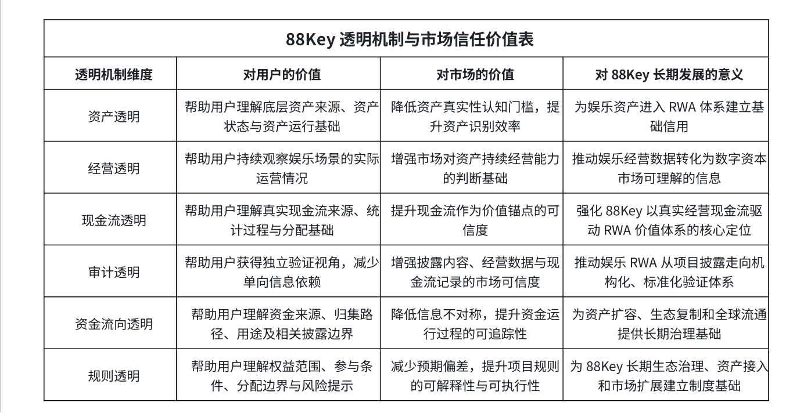

# 7.6 透明机制对市场信任与价值流通的意义

透明机制，是 RWA 资产从现实世界进入数字资本市场的关键桥梁。 对于娱乐产业而言，资产真实并不自动等于市场信任，现金流存在也不自动等于价值可流通。真正能够连接用户、市场和资本网络的，是一套能够持续披露、持续验证、持续审计的透明机制。

88Key 的透明机制，首先有助于降低娱乐资产数字化过程中的信息不对称。传统娱乐经营资产往往存在于企业内部，外部用户难以了解资产状态、经营数据和现金流表现。通过日度披露与现金流验证，88Key 可以将原本分散在经营体系中的信息转化为可被用户持续理解的资产运行数据。

其次，透明机制有助于提升娱乐 RWA 的市场认知效率。用户参与 RWA 资产时，需要理解资产来源、价值形成方式、现金流基础、权益边界和流通路径。当这些信息能够被持续披露和验证，娱乐 RWA 的理解成本就会降低，市场对资产价值的判断也会更加清晰。

第三，透明机制有助于推动娱乐资产形成更高层级的资本表达能力。娱乐产业过去虽然拥有真实消费和现金流，但缺少进入全球资本市场的标准化表达路径。88Key 通过 资产映射、信息披露、现金流验证、独立审计和 GreenX 流通机制，使娱乐资产逐步具备被识别、被配置和被流通的基础。

更重要的是，透明机制能够为 88Key 的长期扩展提供制度基础。随着更多 VIP 包厢、酒吧区域、KTV 包厢、会员消费、Club、Live House 和合作品牌场景进入 88Key 生态，项目需要一套统一的披露与验证标准来承接资产扩容。只有当信任机制具备标准化能力，娱乐 RWA资本网络才具备规模化复制的基础。

因此，88Key 的透明机制不只是项目运营工具，而是娱乐产业资产进入全球数字资本市场的基础设施。 它让真实资产能够被看见，让真实经营能够被验证，让真实现金流能够被追踪，让娱乐 RWA 的价值流通建立在更加清晰、可信和可持续的市场基础之上。

此表展示 88Key 透明机制对用户理解、市场信任和长期生态发展的价值。 对于娱乐 RWA 项目而言，透明机制并不只是信息披露动作，而是连接真实资产、真实经营、真实现金流与全球数字资本市场的重要基础设施。通过 资产透明、经营透明、现金流透明、审计透明、资金流向透明与规则透明，88Key 将进一步强化娱乐资产的 可识别、可验证、可审计、可追踪和可流通 能力。

88Key 的信任体系，建立在真实资产、真实经营、真实现金流、日度信息披露、真实现金流验证和独立审计之上。 这一体系使娱乐 RWA 不再只是资产数字化叙事，而是形成了能够持续观察、持续验证和持续披露的运行机制。

在这一机制中，Daily Disclosure（日度信息披露）提供持续透明基础，Real Cash Flow Verification（真实现金流验证）强化价值来源可信度，Independent Audit（独立审计）增强外部监督与市场信任，资产状态、经营数据和资金流向披露则共同构成用户理解资产运行的核心窗口。

88Key 的长期目标，是通过标准化的信息披露与验证机制，让娱乐资产从线下经营资产升级为可被全球市场识别、验证、配置和流通的数字资本资产。 这套信任体系不仅服务于首个娱乐RWA 验证样本，也将成为未来资产池扩容、多场景复制和全球娱乐 RWA 资本网络建设的重要基础。
