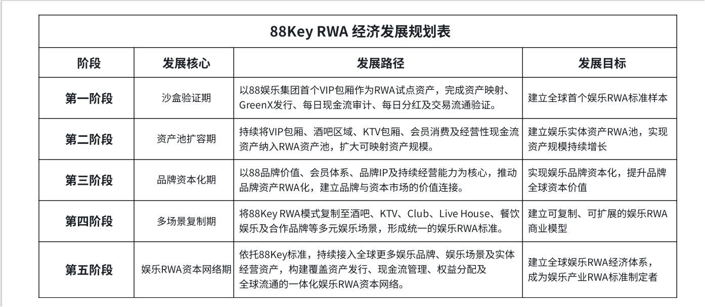

# 8.1 从首个验证样本到娱乐资产池

88Key 的增长起点，是首个娱乐 RWA 验证样本。 该样本以 88 娱乐集团首个 VIP 包厢作为试点资产，通过 资产映射、GreenX 发行、每日现金流审计、现金流分配机制及交易流通验证，建立娱乐资产进入 RWA 体系的基础运行路径。对于项目而言，首个样本的意义并不只是证明某一项资产可以数字化，而是证明娱乐资产能够在真实经营、现金流验证和持续披露基础上形成可复制的 RWA 运行框架。

完成首个验证样本之后，88Key 的下一步重点将进入 资产池扩容阶段。资产池扩容并不是简单叠加更多资产，而是将具备真实经营基础、可识别资产边界和可验证现金流来源的娱乐资产，逐步纳入统一的 RWA 资产池。其核心资产类型包括 VIP 包厢、酒吧区域、KTV 包厢、会员消费及经营性现金流资产 等。

娱乐资产池的建立，将使 88Key 从单一资产验证进入组合资产管理阶段。相比单个资产样本，资产池具备更强的规模承接能力、现金流组合能力和生态扩展能力。通过持续接入不同类型的娱乐经营资产，88Key 可以逐步形成覆盖 空间资产、经营资产、会员资产、品牌资产和现金流资产 的多元价值结构。

这一阶段的核心目标，是建立娱乐实体资产 RWA 池，并实现资产规模的持续增长。 对用户而言，资产池扩容意味着 88Key 不再只代表单点娱乐资产，而是逐步承接更多真实娱乐经营场景的数字权益表达；对市场而言，资产池扩容则意味着娱乐 RWA 从样本验证，开始进入更具规模化基础的资产网络建设阶段。

此表展示 88Key 从首个沙盒验证样本到全球娱乐 RWA 资本网络的五阶段发展路径。 该路径依次包括 沙盒验证期、资产池扩容期、品牌资本化期、多场景复制期和娱乐 RWA 资本网络期。通过这一规划，88Key 将以首个 VIP 包厢验证样本为起点，逐步推动更多娱乐资产进入 RWA 资产池，并进一步实现 娱乐品牌资本化、多场景复制和全球娱乐 RWA 网络建设。
