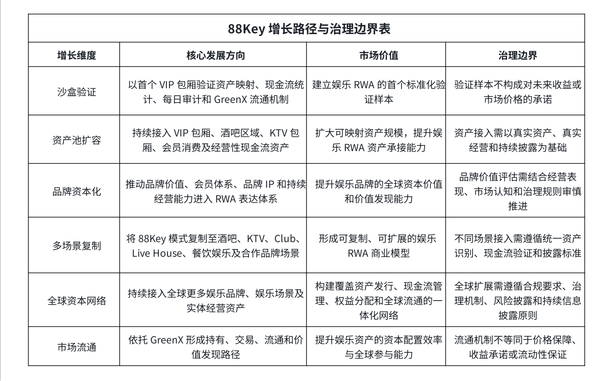

# 8.5 市场参与风险与治理边界

随着 88Key 从单一验证样本走向资产池扩容和全球娱乐 RWA 网络建设，市场参与风险与治理边界必须被清晰呈现。 对外白皮书不仅需要说明增长空间，也必须说明规则边界。对于面向全球用户的 RWA 项目而言，越是强调真实资产、现金流机制和全球流通，越需要保持审慎、透明和规范的披露口径。

首先，资产接入并不等同于资产无风险。 娱乐资产的经营表现可能受到市场环境、用户消费变化、经营成本、场景管理、地区政策、品牌运营能力和宏观经济环境等因素影响。即使资产具备真实经营基础，也不代表未来现金流一定稳定或持续增长。

其次，现金流验证并不等同于固定收益承诺。 88Key 强调真实现金流验证，是为了提升资产运行透明度和价值来源可信度，而不是承诺固定收益、保本回报或无风险收益。现金流相关权益应以实际经营情况、审计结果、平台规则和持续披露为准。

第三，GreenX 流通机制并不等同于价格保障机制。 资产能够进入交易流通，并不意味着其市场价格一定上涨，也不意味着流动性始终充足。市场价格将受到资产质量、经营表现、供需结构、市场情绪、交易深度、平台规则和外部市场环境等多重因素影响。

第四，治理参与并不等同于无限控制权。 基金会治理与 DAO 社区治理机制将为用户参与生态建设、资产接入和重大事项讨论提供框架，但具体治理范围、投票规则、执行程序和治理边界，应以项目正式治理规则和持续披露为准。

因此，88Key 的增长蓝图必须建立在清晰治理边界之上。 项目所推动的是娱乐资产 RWA 化、数字权益表达和全球资本连接，而不是对未来收益、资产价格或市场表现作出确定性承诺。清晰的风险披露和治理边界，正是 88Key 走向长期市场信任的重要前提。

此表展示 88Key 从沙盒验证到全球娱乐 RWA 资本网络的发展路径及治理边界。 88Key 的增长逻辑建立在 真实资产、真实经营、真实现金流验证、持续披露和 GreenX 流通机制 之上。相关机制旨在推动娱乐资产数字化与资本化，但不构成固定收益、保本安排、价格承诺或无风险承诺。
