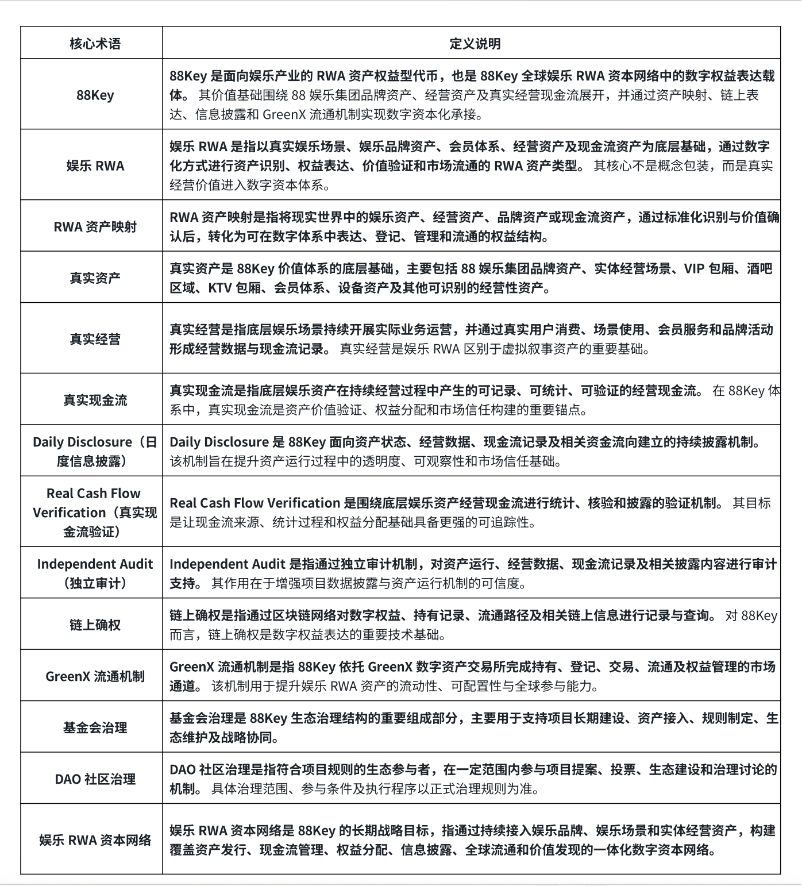

# 附录 A｜核心术语说明

附录 A 主要⽤于统⼀ 88Key ⽩⽪书中的关键概念表达，避免⽤⼾对 RWA、真实现⾦流、链上确权、资产映射、信息披露及治理机制产⽣误读。 对于⾯向全球⽤⼾的娱乐 RWA 项⽬⽽⾔，术语体系本⾝就是项⽬透明治理的重要组成部分，也是建⽴市场信任与⻓期认知的基础。

此表对 88Key ⽩⽪书中的核⼼术语进⾏统⼀说明， 这些术语共同构成 88Key 的基础认知框架，也体现了项⽬围绕 真实资产、真实经
营、真实现⾦流、链上透明和持续披露 建⽴娱乐 RWA 标准化体系的核⼼⽅向。
