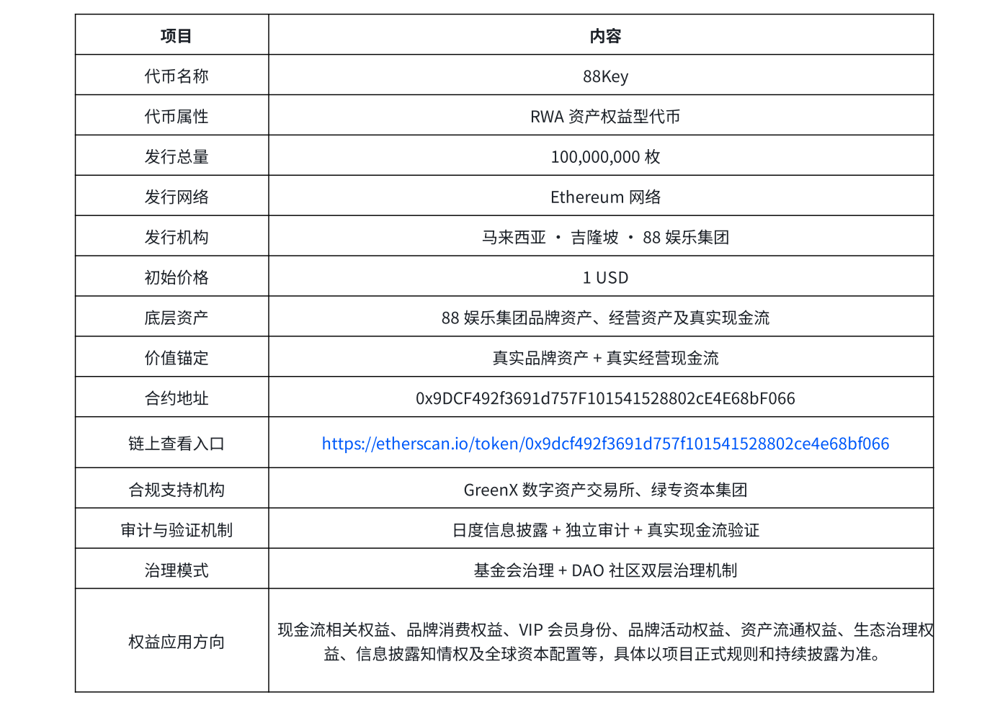

# 附录 B | 88Key 代币基础信息表

 **用于集中披露 88Key 的基础代币信息、链上合约信息及价值锚定结构**。 
 88Key 被定义为 RWA 资产权益型代币，其核心功能并不是脱离现实资产独立存在的流通符号，而是围绕 88娱乐集团品牌资产、经营资产及真实现金流形成的数字权益载体。
 

 
 此表展示 88Key 的代币基础信息及链上披露入口， 88Key 的链上合约地址纳入项目透明披露体系，用户可通过 Etherscan 查看代币基础信息、合约状态及相关链上记录。合约公开查询、链上信息可查看与数字权益可追踪，并不构成收益承诺、价格承诺或安全审计结论。88Key 的长期价值仍将建立在 真实资产质量、持续经营能力、真实现金流验证、信息披露机制、治理规则执行与市场参与结构 之上。

