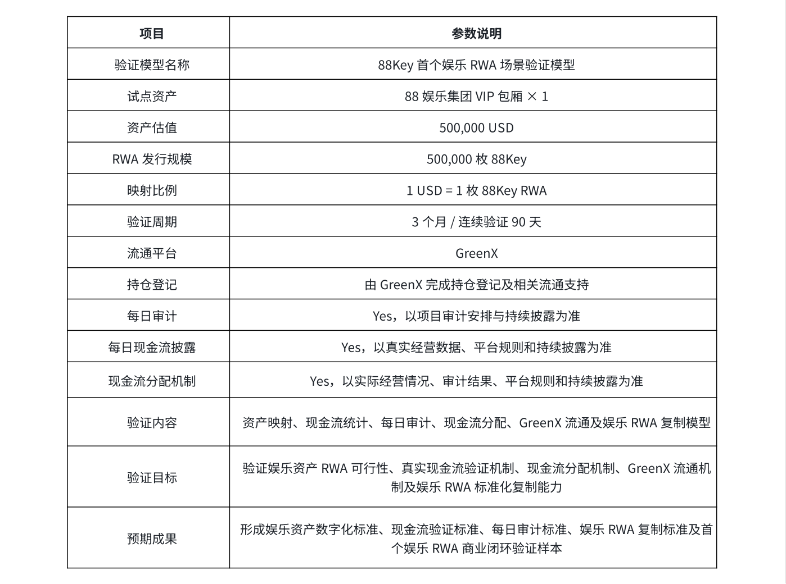

# 附录 C｜首个验证模型参数表

**用于披露 88Key 首个娱乐 RWA 场景验证模型的核心参数**。 该模型以 88 娱乐集团单个VIP 包厢 作为首个 RWA 试点资产，围绕 资产估值、RWA 发行、GreenX 持仓登记、每日营业、现金流统计、每日审计、现金流分配、连续验证及后续资产复制 建立完整验证路径。

此表展示 88Key 首个娱乐 RWA 场景验证模型的核心参数。 该模型的意义并不局限于单一 VIP 包厢，而在于通过一个可观察、可验证、可审计的真实娱乐场景，验证娱乐资产从 现实资产识别、价值映射、现金流验证、数字权益表达、GreenX 流通到后续资产复制 的完整路径。其核心定位是：一个包厢，验证一套模型；一个模型，复制一个产业。
